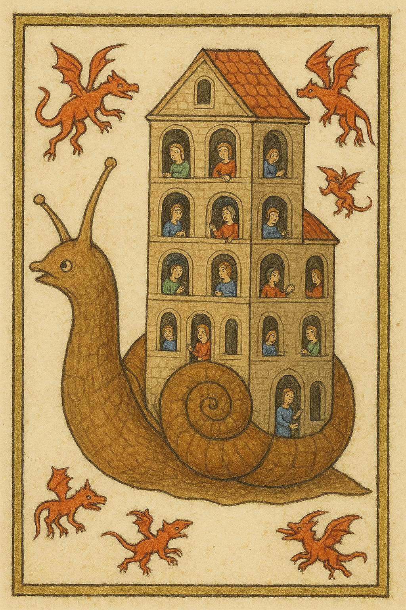
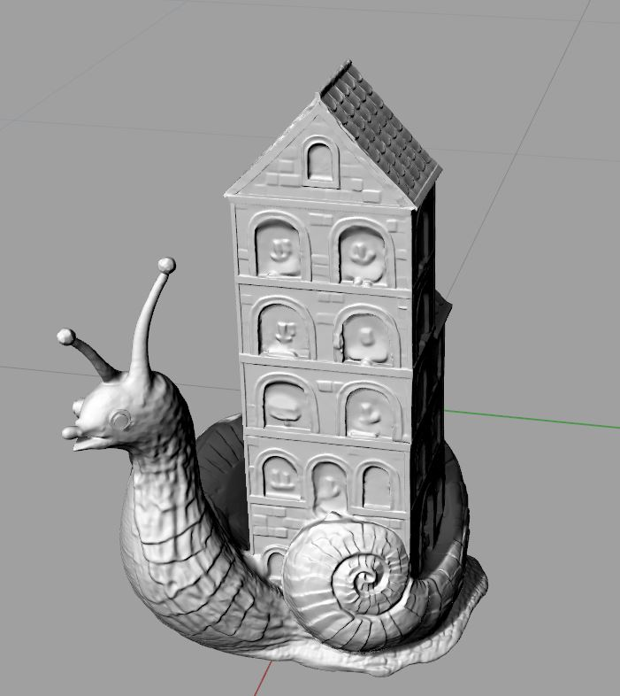
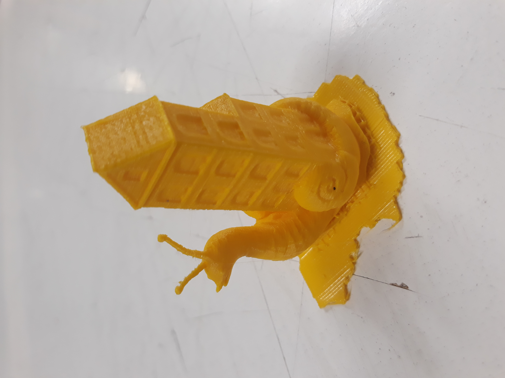

# figurines 3D
Utilisation d'une chaine d'outils pour produire des objets 3D

 Un petit texte pour expliquer comment fabriquer une figurine imprimée en 3D à partir d'une image. 
Je n'ai rien inventé, ni les IA (Chatgpt, Tripo3d), ni la chaîne d'action décrite ici par [Jean-Noël Saint-Trapt](https://www.saintrapt.com/projet-pedagogique-concevoir-des-prototypes-de-figurines-pour-un-jeu-de-cybersecurite/)

Les fichiers sont dans le repertoire escargot : 

1. Le dessin de l'[escargot-maison](./escargot/original.jpg)
2. Le [modèle 3D engendré](./escargot/fantasy+snail+tower+3d+model.stl) par [Tripo3d](https://studio.tripo3d.ai). Il reste un cadre inutile, que j'ai enlevé avec Rhino. Je n'ai pas réussi dans Blender... J'aurai pu
plus facilement l'enlever dans le dessin original avec Gimp...
3. Le [même modèle 3D](./escargot/fantasy+snail+tower+3d+model.stl) sans le cadre. 
4. Le [fichier](./escargot/dagoma0.g) pour la dagoma. Pas utile si vous avez une autre machine. 
5. Quelques photos et vidéo dans le repértoire 

La démarche est simplissime, ce sont les IA qui font tout : 
1 Je demande à ChatGPT de m'engendre une image
Le prompt qui a servi à créer le dessin de l'escargot-immeuble : 

>Toujours dans le style miniature, je voudrais un escargot qui soit aussi un immeuble d'habitation, 
avec une multitude de petits personnages aux fenetres et sur les balcons dans des activités toutes 
différentes. des tout petits dragons volent tout autour de l'escargot

Le dessin créé par Chatgpt : 

2 Je demande à [Tripo3d](https://studio.tripo3d.ai)  de transformer ce dessin en forme 3D (fichier STL). L'échelle est toute petite, il faut l'agrandir. 
Le modèle 3D dans Rhino (Blender marche aussi) :

3. J'imprime.

4. Je peins . 
